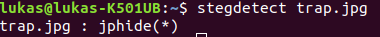
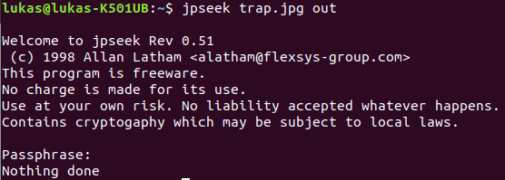
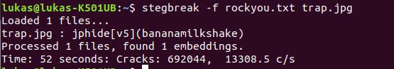
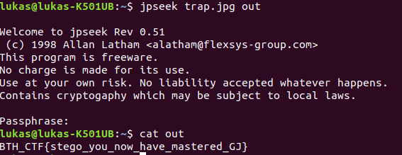

# what_is_stego (misc)

## Find the hidden flag

Made by me so this is the intended solution, a little bit heavy on the use of programs but that is the steganography-life :)  

(for some reason I did this with the windows versions of jphide and jpseek (version 0.51) which does not seem to be compatible with  the linux 0.3 version... So I am sorry if you did this right but got garbage at the end!)

It is a jpg file and it mentions stego so lets pick some tool which can handle jpg files.

Ok so it is something hidden inside this image whith jphide so lets try to extract it whith its counterpart program jpseek.  

  
Looks like it is password protected... Okay so lets bring out a password cracking program, stegbreak and use rockyou to look for commonly used passwords.

(Stegbreak might crash if it doesn't find a "rules-file" - I have used john the ripper's).
Ok cool it found the password "bananamilkshake" so lets try that with jpseek:

Boom flag found!
