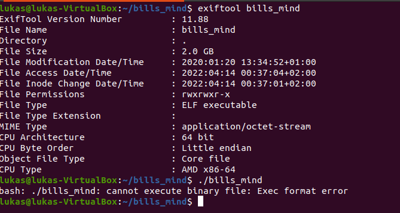
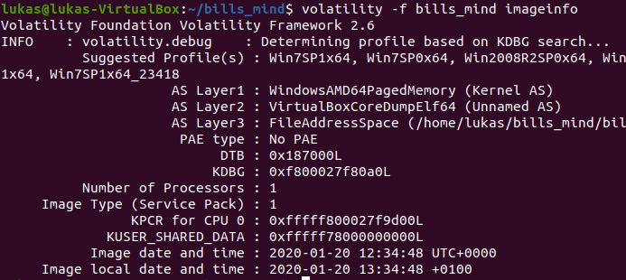
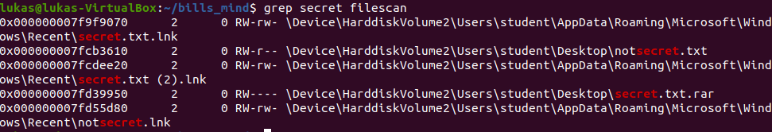
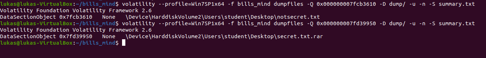
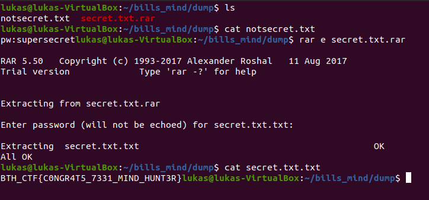
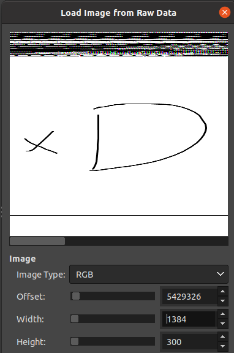

# Bills Mind

### Challenge description:
Good ol' Bill has been behaving odd as of late - I made a copy of his mind for you to investigate whats going on.
___________________

### Walkthrough: 

We are given 2 GB alledged ELF file, but its not executable:    
 

Running something like ```head -n 10 bills_mind | xxd``` reveals contents like "VBOX", "VBOXBIOS". This being forensics and a file of this size - it might be a RAM memory dump?  Yes it is:  
 

Searching for interesting files:
```volatility --profile=Win7SP1x64 -f bills_mind filescan > filescan```
  

And carve them out:    
   

After changing their names we find the password and can extract the flag:  
   


__________________________
### Evil goose hunt

Checking processes with : ```volatility --profile=Win7SP1x64 -f bills_mind pslist```

Process that stands out somewhat:
 - mspaint
 - cmd 

cmd.exe can be disregarded with cmdscan which shows the entered commands. mspaint is an evil timedecoy where you can dump its memory and load it into gimp, find the right offset and see an XD.
 


