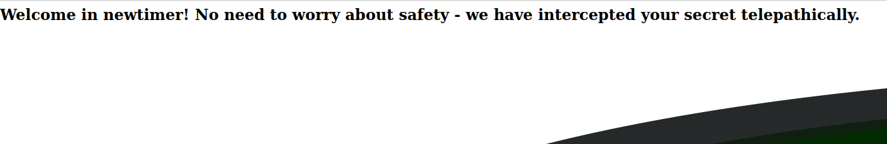
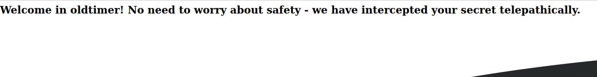
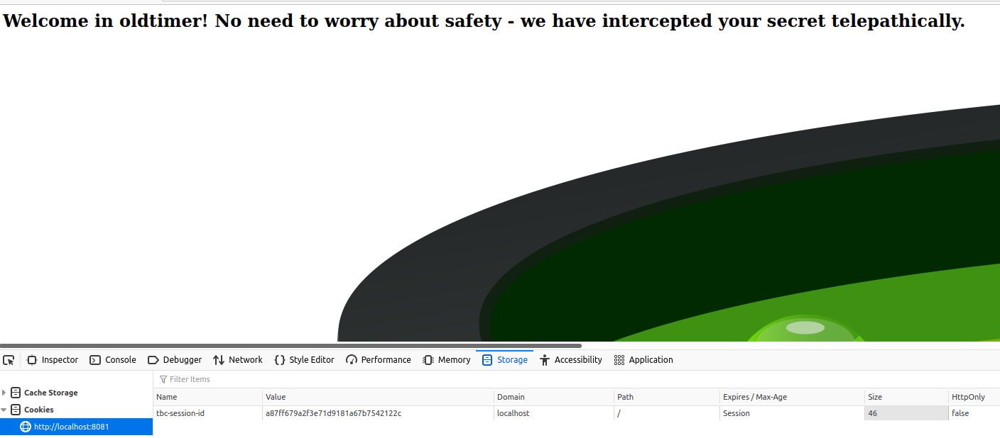
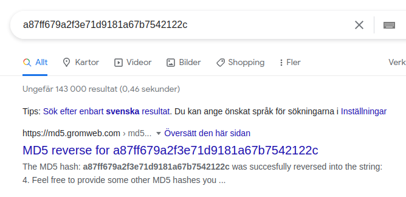
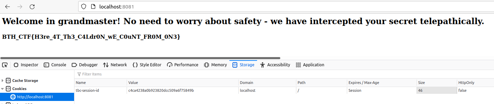

# Bubbling Cauldron

### Challenge description:
After last years login debacle, this time we have increased security here at the bubbling cauldron.
_________________
### Walkthrough: 
The view of the website:  
  
The website does not really contain anything more than what is presented. It does greet you with one message the first time you visit and another message after the first time.   
  
Which is meant as a hint to go look at the cookie. 
  
The cookie value is the md5hash of a number between 2 and 10. The intended solution and leap of faith is to either recognize that this might look like an MD5 or some type of hashsum or just google the hash which would reveal its secret:  
  

Once it is understood that the cookie id is the md5sum of a low number the vulnerability the solution is to try "authenticating" by changing the cookie value to the lowest number possible, in this case 1. md5(1) == c4ca4238a0b923820dcc509a6f75849b will yield the flag BTH_CTF{H3re_4T_Th3_C4Ldr0N_wE_C0uNT_FR0M_0N3}  
  
