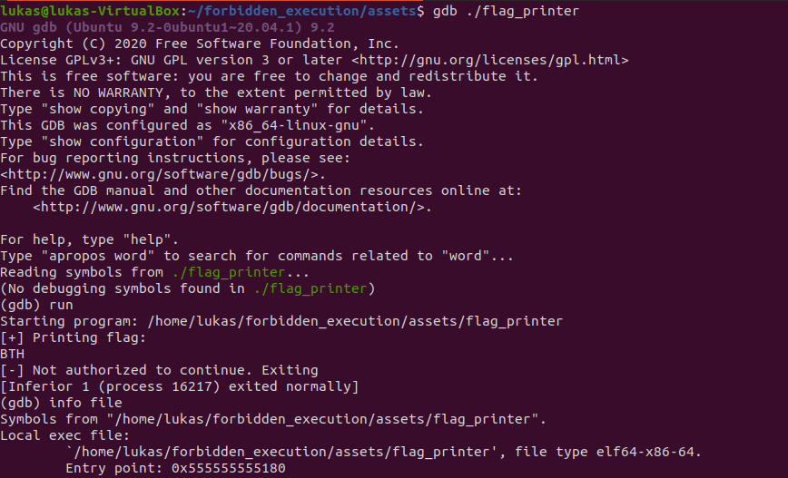

# Forbidden Execution

### Challenge description:
There is this wierd printing-device that everyone has access to and can start but it seems to be broken and does not output anything of value. Maybe you could trick it into revealing its secrets?


### Walkthrough: 
________
The idea of this challenge is to either find where the program stores the flag and manually decrypt it or to find and patch the included stops in the program.
________

We are given an ELF executable which we can try to run and it gives us the first three characters of the flag:  
  

Here given that this is a reverse challenge and that we are not authorized to continue it is time to fire up gdb / Ghidra or your other favourite tool of choice.


One thing to notice here is that the binary is stripped which will make debugging a bit harder. One trick to find the entry point is to open the binary in GDB and run it then execute "info file":  
   

Set a breakpoint at the entry and execute
```
b *0x555555555180
run
```
Here it helps to have [gdb-peda](https://github.com/longld/peda ) or other assisting tools: / looking ahead at what instructions is coming:  
 

Running the code a few times and observing where we fail (or easier: looking at a disasabled version of the code) this is where the program exits, here Ghidra is used:

 
 

Not taking the jump instruction after the compare will take us to the exit. Here one could either skip ahead and jump to the return or fix the comparison to return true. This solution fixes the compare:

```
b *0x555555555275
set $edi = 0x1
```
So everytime this breakpoint hits, change the value of edi. Next stop on the way will be this similar check where we also want to fix a compare and take the jump: 
 
 

```
b *0x5555555552c2
set $edi = 0x5
```

The last stop on our way is this check in the main function: 
 

Instead of fixing the compare we could also as earlier mentioned just tell the program where to jump. In this case we would like to jump over the exit call and continue.   
 

```
b* 0x5555555557c1
set $rip = 0x5555555557c6
```
and this will let the program finish printing the flag:   
 
