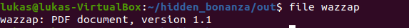

# Hidden Bonanza

### Challenge description:
This is a field manual by some of the very BEST, it might come in handy! GLHF
___________________
### Walkthrough: 
We are given a readable PDF with a interesting and relevant topic:  
 

Step one is the realize there are something hidden in the PDF and run something like binalk or foremost to find and carve it out. The zip archive with "wazzap" seems interesting:

 

However it does not work to unzip it.
 

Lets dig into the data of the PDF, what is up with this ZIP at end of the PDF. Firing up the best tool of them all, vim:

  
Right of the bat we  find this odd message about PDF comments - which seems to start with %. Alright lets keep that in mind and go to the bottom. Here we can see where the PDF ends and where a picture starts?


At the very bottom we find the reference to wazzap:


Did you spot the issue with this yet? Remember those comments? Every row from "%picture.jpg lies here - do NOT touch" and below starts with a % which destroys the image and the ZIP. Lets carve the last piece out and remove the comments: 


Looks like we got out DEB.zip. Attempting to unzip with ```7z x DEB.zip``` and it asks for a password. Password? and what happened with the image that should have been extracted but was not?

Inspecting the file with xxd we can see that the starting byte is 89 followed by the word JFIF:  


This does not add up according to the [magic bytes](https://en.wikipedia.org/wiki/List_of_file_signatures) of a JPG so something is off here. Other  found keywords in the image data (open with vim) sounds more like a [PNG](http://www.libpng.org/pub/png/spec/1.2/PNG-Chunks.html): "IHDR" and "IEND". The starting byte 89 is also correct for a PNG. Lets just try and switch out JFIF to PNG and extract again. 

*Not sure why, but foremost carves both out, binwalk can not manage to get the image out unless the zip-data is manually removed. At this point it is also very easy to manually carve both out to individual files.*  


Now we get the image out which contains the password to the zip:  


The password works but is a very suspicious password, surely it is a clue to the next bit. The extracted file contains data which structurally looks like a PDF but the words are all wrong: 


Researching the vim commang g? as we are told it seems to perform ROT13, is this a ROT13 encoded PDF? Applying g? to the whole file can be done in vim with this command: ```ggVGg?```  and it results in a PDF: 


Inspecting the PDF there is one object stream that contains yibberish, this particular stream has the filter FlateDecode:  


 Googling on how to extract Flatedecoded data from an PDF we can for example find the software [qpdf](https://github.com/qpdf/qpdf  ) which has this functionality. 
 
 This is the final step for a flag with a very relevant name: 
 
_________________
### TLDR
1. Find appended data at the bottom of the PDF. 
2. Remove the preappended PDF-comment-character '%' on each line
3. Its not a JFIF (JPG) its a PNG
4. Password to zip is in the PNG (use 7z to extract)
5. Use clue from PNG to ROT-13 decode the extracted file -> turns it into a PDF
6. Find a tool to decode the Flatedecoded object stream, for example qpdf.
7. Win.
