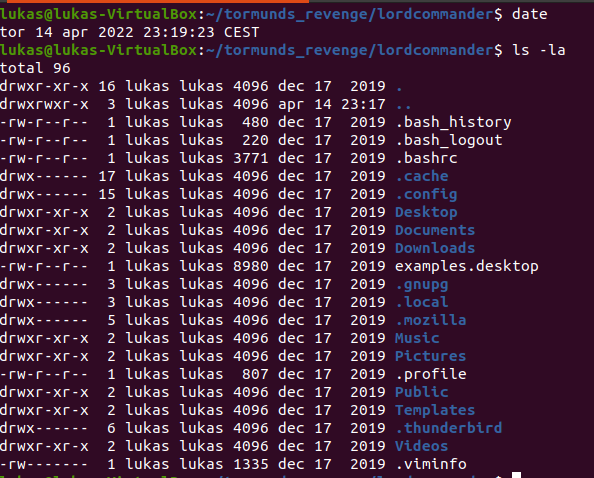
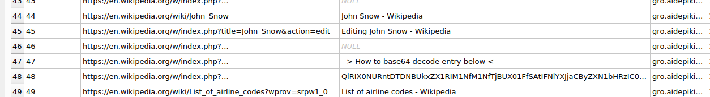
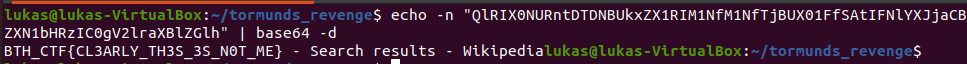

# Tormunds Revenge

### Challenge description:
I managed to grab lord crow's homefolder while he was away doing whatever crows do. Hopefully there is something of use in there!
____________________
### Walkthrough: 
We are given the file lordCommander.tar. Extracting the contents with  ```tar -xvf lordCommander.tar``` we get something that looks like a linux home directory:  
 

There is not much to explore in this home directory so pretty soon you are looking at the .mozilla folder and the user's browser history in ```.mozilla/firefox/ptjej2t7.default-release/places.sqlite``` (sqlitebrowser is nice to use)
 

Decoding the base64 gets us the flag:  
 

_____
General CTF-speedrunning tip here, grep for the flag format and also as base64: ```grep -R "BTH_" .``` or ```grep -R "QlRIX0" .```