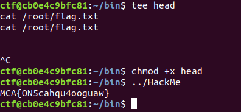

# Getting A Head (Linux)

## What can we do?
When logged in and executing the ls command I can see that we have an executable with root privileges that I can run. This is probably the way to escalate our privileges.

A test run of the file does not give us anything. By using the _strings_ command on the file we might get a little bit more understanding of what it is doing.

Looks like a C program which uses **system** to execute the _head_ command on the file _/var/log/auth.log_

## Lets try to exploit system()
System looks in the PATH environment variable after a location with an executable called head. If can put my own executable called head in one of those locations it will be executed with root privileges.

Lets check out the PATH variable.

Okay the location in the home folder seems perfect, lets create it and then an executable called head.

The flag is located at _/root/flag.txt_ which we do not have permissions to read from. (This can be found out from the previous linux-challenge or by using the head file for looking around with for example _find / flag | grep flag_)

Boom privilege escalated! Nice challenge - do not use system() folks.

