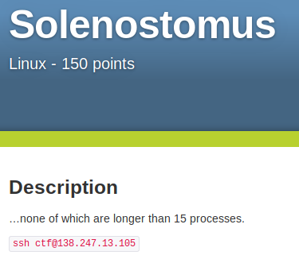
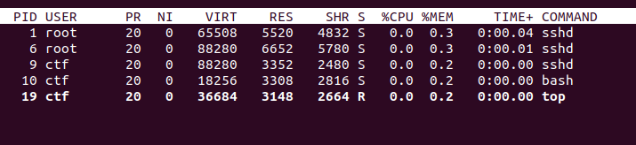
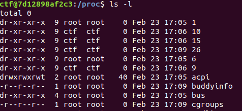
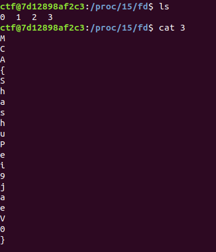

# Solenostomus (Linux)

## What can we do?
Okay after looking around for a while nothing obvious appears but the description mentions processes so lets look at _top_.

Okay surprisingly few processes but nothing wierd. Lets look at _/proc_

One wierd thing here is the process called 15 which does not appear on _top_ but is mentioned in the challenge description AND is owned by my user so lets investigate more in there.

Flag found!

